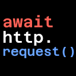

## AwaitableHTTPRequest Node for Godot 4

This addon makes HTTP requests much more convenient to use by introducing the `await`-syntax and removing the need for signals.

### Usage

Here is an example with minimal error-handling:

```py
@export var http: AwaitableHTTPRequest

func _ready() -> void:
    var resp := await http.async_request("https://api.github.com/users/swarkin")
    if resp.success():
        print(resp.status)                   # 200
        print(resp.headers["content-type"])  # application/json

        var json = resp.body_as_json()
        print(json["login"])                 # Swarkin
```

See `examples.tscn` for more.

---

> Available on the [Godot Asset Library](https://godotengine.org/asset-library/asset/2502)

<sub>Requires Godot 4.1</sub>
